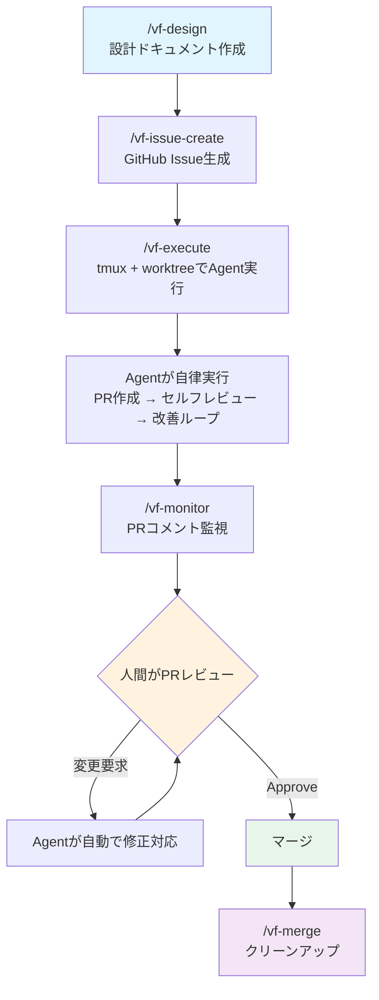
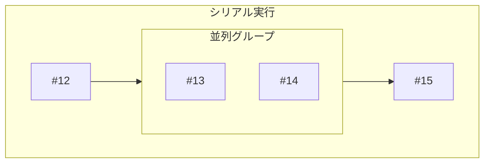
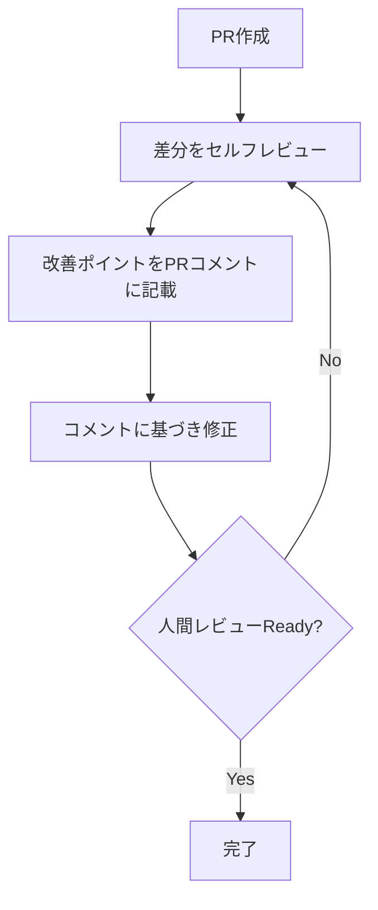

# github-vibe-flow

GitHub Issue駆動でCoding Agentと人間が協働するためのClaude Code Plugin。

人間は**起点（アイデア）**と**関門（レビュー承認）**に集中し、設計・実装・セルフレビュー・レビュー対応はAgentが自律的に行います。

## 全体フロー



> `/vf-flow` を使うと上記フロー全体を一気通貫で実行できます。各スキルは単体でも利用可能です。

## インストール

### 前提条件

- [Claude Code](https://claude.ai/code) (プラグイン対応版)
- GitHub MCP Server が設定済みであること
- tmux
- git
- gh CLI

### インストール

```bash
claude plugin add ensekitt/github-vibe-flow
```

## スキル一覧

| スキル | コマンド | 説明 |
|---|---|---|
| `vf-design` | `/vf-design` | brainstormingで設計ドキュメント作成 |
| `vf-issue-create` | `/vf-issue-create` | 設計ドキュメントからGitHub Issue生成 |
| `vf-execute` | `/vf-execute` | tmux + worktreeで複数Agent並列実行 |
| `vf-monitor` | `/vf-monitor` | PRコメント監視 → Agent自動対応 |
| `vf-merge` | `/vf-merge` | worktree・ブランチ・設計ドキュメントのクリーンアップ |
| `vf-flow` | `/vf-flow` | 上記すべてを統括するメタフロー |

## 各スキルの詳細

### `/vf-design` — 設計

superpowersプラグインのbrainstormingスキルをラップし、対話的に設計ドキュメントを作成します。

**入力:** アイデアやテーマ（自由テキスト）

**出力:** `docs/plans/YYYY-MM-DD-<topic>-design.md`

設計ドキュメントには通常のbrainstorming成果物に加え、以下が含まれます:
- **Issue分割案** — 実装可能な単位に分割されたIssue一覧
- **実行記法** — Issue間の依存関係を表す記法（例: `[1, (2, 3), 4]`）
- **受け入れ基準** — 各Issueの完了条件

```bash
# 使用例
/vf-design 認証機能を追加したい
```

---

### `/vf-issue-create` — Issue生成

設計ドキュメントを読み取り、GitHub Issueを自動生成します。

**入力:** 設計ドキュメントのパス

**出力:** GitHub Issues + 実行記法の更新

```bash
# 使用例
/vf-issue-create docs/plans/2026-03-15-auth-design.md
```

処理内容:
1. 設計ドキュメントのIssue分割案を読み取り
2. 各IssueをGitHub MCP経由で作成（`vibe-flow`ラベル付与）
3. 仮番号を実Issue番号に置換（`[1, (2, 3), 4]` → `[#12, (#13, #14), #15]`）
4. 人間に確認を求める

---

### `/vf-execute` — 実行

実行記法に基づき、tmuxペイン + git worktreeで複数のClaude Codeインスタンスを管理します。

**入力:** 実行記法（例: `[#12, (#13, #14), #15]`）または設計ドキュメントのパス

```bash
# 使用例
/vf-execute [#12, (#13, #14), #15]
```

処理内容:
1. tmuxセッション確認（なければ作成）
2. 実行記法をDAGとしてパース
3. 各Issueに対しworktree作成 → tmuxペインでClaude Code起動
4. 各AgentはIssue実装 → PR作成 → セルフレビュー＆改善ループを自律実行



#### セルフレビュー＆改善ループ

各Agentは作業完了後、以下を自律的に繰り返します:



---

### `/vf-monitor` — 監視

専用tmuxペインで常駐し、PRへの人間のレビューコメントを検知してAgentを自動起動します。

**入力:** ポーリング間隔（オプション、デフォルト30秒）

```bash
# 使用例
/vf-monitor        # デフォルト30秒間隔
/vf-monitor 60     # 60秒間隔
```

処理内容:
1. `vibe-flow`ラベルのopen PRを監視対象として取得
2. 定期的にPRコメント・レビューをポーリング
3. 人間のコメント検知時、worktree + tmuxペインでAgentを起動して修正対応
4. 全PRがマージ/クローズされたら自動終了

---

### `/vf-merge` — クリーンアップ

フロー完了後のリソースを一括で片付け、ローカル環境をクリーンな状態に戻します。

```bash
# 使用例
/vf-merge
```

処理内容:
1. マージ済みの`vibe-flow`PR関連リソースを特定
2. クリーンアップ対象の一覧を表示し人間に確認
3. worktree削除、ブランチ削除、設計ドキュメントの削除/アーカイブ、tmuxペインのクローズ
4. デフォルトブランチに切り替えて`git pull`で最新化

---

### `/vf-flow` — メタフロー

上記すべてのスキルを順番に呼び出すE2Eオーケストレーター。

```bash
# 使用例
/vf-flow 新しい決済機能を実装したい
```

途中で中断した場合、各スキルを単体で呼び出して任意のステップから再開できます。

## 実行記法

Issue実行順序を`[]`（シリアル）と`()`（パラレル）で定義します:

| 記法 | 意味 |
|---|---|
| `[#1, #2, #3]` | #1 → #2 → #3 を順番に実行 |
| `(#1, #2, #3)` | #1, #2, #3 を同時に実行 |
| `[#1, (#2, #3), #4]` | #1完了後、#2と#3を並列実行、両方完了後に#4 |

ネストも可能です:

```
[#1, (#2, [#3, #4]), #5]
```
→ #1完了後、#2と[#3→#4]を並列実行、すべて完了後に#5

## ライセンス

[MIT License](LICENSE)
